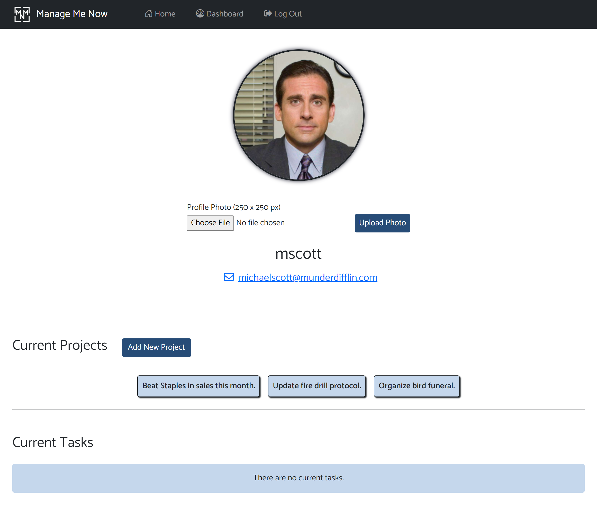
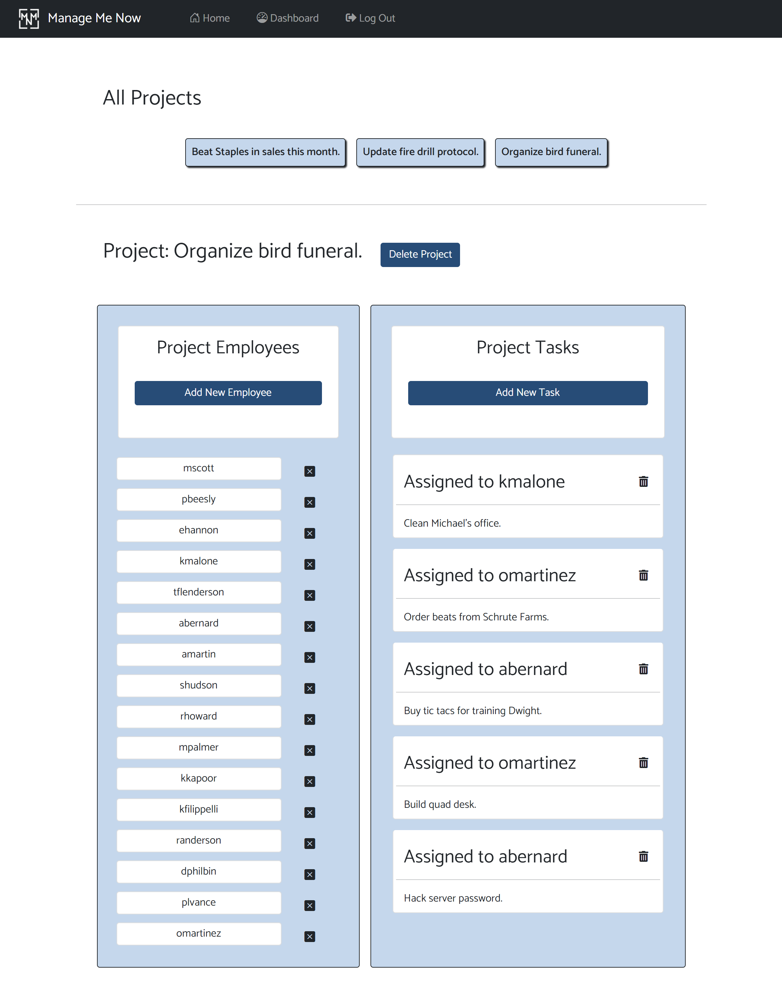
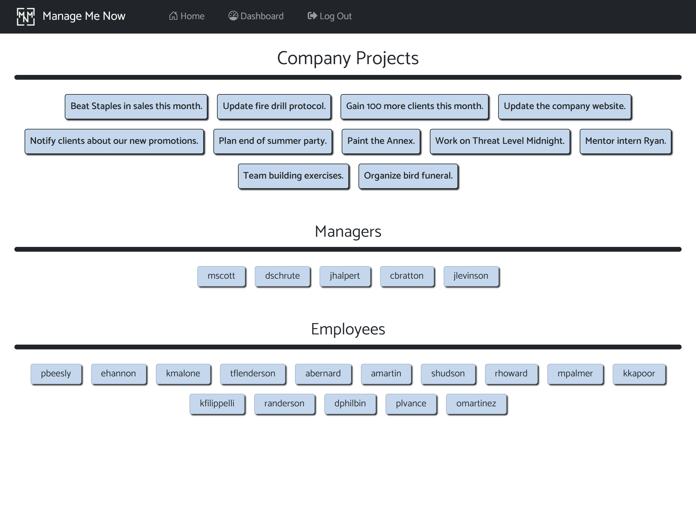

# Project-Manager
A web application for managing your employees, projects, and tasks.

[Live site!](https://manage-me-now.herokuapp.com)

[License](https://img.shields.io/static/v1?label=license&message=MIT&color=FFFF00&logo=github&logoColor=FFFF00&style=plastic)

## Description
- We built this web application because we realized how difficult it is to manage a small group, let alone a large one. There are lots of ideas and to do lists flying around, so it makes sense to keep it all in one place. 
- This web application solves the problem of organizing your teams, projects, and tasks in a simple concise manner.
- We all learned a great deal about handlebars, servers, routes, javascript and bootstrap.

## Table of Contents
- [Project-Manager](#project-manager)
  - [Description](#description)
  - [Table of Contents](#table-of-contents)
  - [Installation](#installation)
  - [Usage](#usage)
  - [Credits](#credits)
  - [License](#license)
  - [Contributing](#contributing)
  - [Tests](#tests)
  - [Contact](#contact)

## Installation
1. Provided that you have a code editor of your choosing installed on your system, such as VS Code (https://code.visualstudio.com/),

2. Provided that you have a Terminal installed for Windows (https://www.microsoft.com/en-us/p/windows-terminal/9n0dx20hk701?rtc=1&activetab=pivot:overviewtab) or are using a Mac with Terminal installed with the OS,

3. Provided that you have npm and Node.js installed for windows (https://www.npmjs.com/get-npm),

4. Provided you have Git and Github Desktop installed (https://git-scm.com/downloads, https://desktop.github.com/) and have registered for an account,

5. Provided you have MySQL and MySQL workbench installed (https://www.mysql.com/downloads/),

6. Either Clone or Fork this repository: (https://github.com/Justinean/Manage-Me-Now.git),

7. After cloning the repository to your local computer, initialize npm, as well as install aws-sdk, bcrypt, connect-session-sequelize, dotenv, express, express-handlebars, express-session, multer, multer-s3, mysql2, node-fetch, and sequelize node modules. 

## Usage
- Use sign up to create a user profile. Make sure to check yourself as a manager, if you are needing to create and edit projects.
- You can add new projects on your dashboard. 
- Click on project names to access the employee and task lists for each, including the ability to add and delete employees and tasks from projects.
- Clicking on any employee name will bring you to their dashboard, so you can view current projects and tasks that they are on.

## Credits
- Collaborators
  - [Brian Palay](https://github.com/bpplaysguitar)
  - [Justin Hoch](https://github.com/Justinean)
  - [Melody Monyok](https://github.com/mmonyok)
  - [Mohamed Ahmed](https://github.com/MohamedAhmed24)

- Technologies Used:
  - [Handlebars](https://handlebarsjs.com/)
  - [CSS](https://www.w3schools.com/css/)
  - [Bootstrap](https://getbootstrap.com/)
  - [JavaScript](https://www.w3schools.com/js/)
  - [FontAwesome](https://fontawesome.com/)
  - [Google Fonts](https://fonts.google.com/)
  - [EZ GIF](https://ezgif.com/maker)
  - [Node.js](https://www.npmjs.com/get-npm)
  - [node-fetch Node Module](https://www.npmjs.com/package/node-fetch)
  - [NPM](https://www.npmjs.com/get-npm)
  - [Express.js](https://expressjs.com/)
  - [express-handlebars Node Module](https://www.npmjs.com/package/express-handlebars)
  - [express-session](https://www.npmjs.com/package/express-session)
  - [mysql2 Node Module](https://www.npmjs.com/package/mysql2)
  - [sequelize Node Module](https://www.npmjs.com/package/sequelize)
  - [connect-session-sequelize Node Module](https://www.npmjs.com/package/connect-session-sequelize)
  - [dotenv Node Module](https://www.npmjs.com/package/dotenv)
  - [bcrypt Node Module](https://www.npmjs.com/package/bcrypt)
  - [Free Online Photoshop](https://www.freeonlinephotoshop.com/en/)
  - [aws-sdk Node Module](https://www.npmjs.com/package/aws-sdk)
  - [multer Node Module](https://www.npmjs.com/package/multer)
  - [multer-s3 Node Module](https://www.npmjs.com/package/multer-s3)

## License
MIT License

Copyright (c) [2021] [Brian Palay, Justin Hoch, Melody Monyok, & Mohamed Ahmed]

Permission is hereby granted, free of charge, to any person obtaining a copy
of this software and associated documentation files (the "Software"), to deal
in the Software without restriction, including without limitation the rights
to use, copy, modify, merge, publish, distribute, sublicense, and/or sell
copies of the Software, and to permit persons to whom the Software is
furnished to do so, subject to the following conditions:

The above copyright notice and this permission notice shall be included in all
copies or substantial portions of the Software.

THE SOFTWARE IS PROVIDED "AS IS", WITHOUT WARRANTY OF ANY KIND, EXPRESS OR
IMPLIED, INCLUDING BUT NOT LIMITED TO THE WARRANTIES OF MERCHANTABILITY,
FITNESS FOR A PARTICULAR PURPOSE AND NONINFRINGEMENT. IN NO EVENT SHALL THE
AUTHORS OR COPYRIGHT HOLDERS BE LIABLE FOR ANY CLAIM, DAMAGES OR OTHER
LIABILITY, WHETHER IN AN ACTION OF CONTRACT, TORT OR OTHERWISE, ARISING FROM,
OUT OF OR IN CONNECTION WITH THE SOFTWARE OR THE USE OR OTHER DEALINGS IN THE
SOFTWARE.

## Contributing
- Please submit any contributions you think will improve this project.

## Tests
- No further testing is needed, unless any new contributions are made; the owner of this project will locally test any contribution submissions prior to approval.

## Contact
- Brian Palay
  - <brianpalay@gmail.com>
- Justin Hoch
  - <justinonlycoding@gmail.com>
- Melody Monyok
  - <monyokwebdev@gmail.com>
- Mohamed Ahmed
  - <mohamed.ahmed1357@yahoo.com>